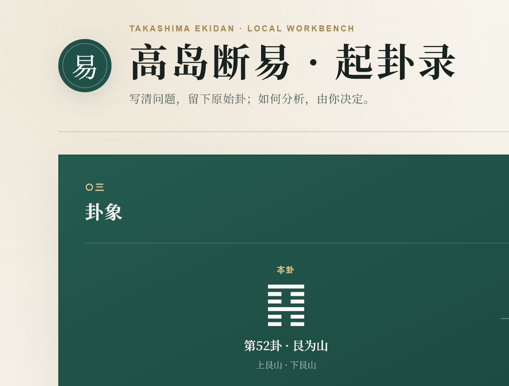

# 高岛断易 · 起卦录

一个无需安装、无需登录、可离线运行的六爻起卦与 Markdown 导出工具。

> [!IMPORTANT]
> 本项目只计算并记录本卦、动爻、之卦与互卦，不提供自动解读，也不收录或伪造《高岛易断》原文。卦象属于传统文化与解释性材料，不能替代医疗、法律、财务、交易等领域的现实证据和专业意见。

## 在线使用

**[打开在线版 →](https://aureolenode.github.io/takashima-ekidan/)**

在线版与仓库中的静态文件相同：GitHub Pages 只负责把页面发送到浏览器，问题和卦象计算在浏览器本地完成，本项目不会把输入内容提交到服务器。



## 功能

- 一键模拟六次三钱法，自下而上生成六爻；
- 自动计算本卦、动爻、之卦和互卦；
- 将问题与原始卦象导出为 Markdown；
- 支持日间、夜间主题；
- 纯 HTML、CSS、JavaScript，无依赖、无构建步骤、无后端。

## 快速开始

1. 下载或克隆本仓库。
2. 双击打开 `index.html`。
3. 输入一个明确的问题；需要时间范围时直接写进问题。
4. 点击“一键起卦”。
5. 查看结果，按需点击“导出卦象”。

更详细的操作说明见 [`傻瓜使用说明.md`](傻瓜使用说明.md)。

## 计算规则

页面模拟六次三钱法，每次得到 6、7、8、9 中的一个数值：

| 数值 | 爻 | 状态 |
|---:|---|---|
| 6 | 老阴 | 动爻，阴变阳 |
| 7 | 少阳 | 静爻 |
| 8 | 少阴 | 静爻 |
| 9 | 老阳 | 动爻，阳变阴 |

六爻始终按“初爻 → 上爻”记录。支持 Web Crypto 的浏览器优先使用 `crypto.getRandomValues()`；不支持时才回退到 `Math.random()`。这是软件随机模拟，不是实体掷币，也不声称具备统计预测能力。

## 数据与隐私

- 项目没有服务器、账号系统、统计脚本或网络请求；
- 问题和卦象不会自动上传；
- `localStorage` 只保存日间/夜间主题偏好；
- 点击“导出卦象”时，浏览器才会在本机生成 Markdown 文件；
- `.gitignore` 默认排除 `卦象/` 和 `解读/`，避免个人占问和复盘被误传到 GitHub；
- 本公开仓库不包含作者的历史卦例、解读记录或其他个人资料。

在线访问时，GitHub 作为托管服务商仍会像普通网站一样接收到必要的访问请求信息，例如 IP 地址、浏览器类型和访问时间；这与项目是否读取你的问题是两件不同的事。敏感问题建议继续下载后离线使用。

完整说明见 [`PRIVACY.md`](PRIVACY.md)。

## 文件结构

```text
.
├─ index.html             # 页面结构，直接打开即可
├─ styles.css             # 页面样式与响应式布局
├─ app.js                 # 起卦、卦象计算与 Markdown 导出
├─ 傻瓜使用说明.md         # 面向第一次使用者的逐步说明
├─ PRIVACY.md             # 隐私与本地数据说明
├─ assets/
│  ├─ project-preview.png # 在线项目预览
│  └─ wechat-sponsor.jpg  # 自愿赞助二维码
└─ tests/
   └─ app.test.js         # 无第三方依赖的核心逻辑检查
```

个人使用时可以自行创建 `卦象/` 和 `解读/` 文件夹。前者只保存原始问题与卦象，后者保存解读和事后复盘；不要把事后结论回填到原始记录。

## 开发与验证

安装 Node.js 后运行：

```bash
npm test
```

测试覆盖 64 卦编号唯一性、乾坤基本映射、动爻变化与 Markdown 导出关键字段。日常使用不需要 Node.js。

需要本地 HTTP 预览时可运行 `npm start`，然后访问 `http://127.0.0.1:8765/`。

## 已知边界

- 当前仅支持现代桌面与移动浏览器；
- 下载位置由浏览器设置决定；
- 字体和易经卦符的显示效果取决于操作系统；
- 本工具不包含卦辞、爻辞、断语、AI 提示词或自动分析功能；
- 原典引用应注明书名、版本和页码，AI 生成内容必须与原典明确区分。

## 喜欢就赞助一下 ☕

如果这个小工具对你有帮助，可以自愿请作者喝杯咖啡。赞助不构成购买、咨询或任何服务承诺。

<details>
<summary>查看微信赞助码</summary>

<br>


</details>

## 许可

当前仓库尚未附加开源许可证，默认保留所有权利。若计划允许他人复制、修改或再发布，建议后续明确选择并加入合适的开源许可证。
